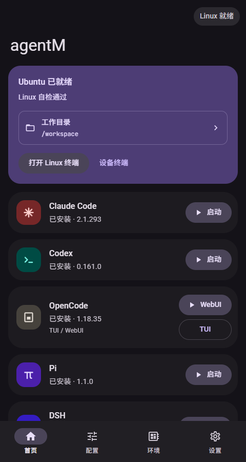
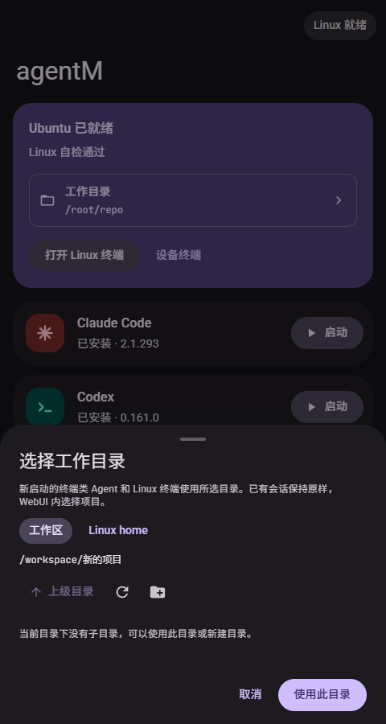

<div align="center">

# agentM

**把 AI 编程工作台装进口袋。**

在 Android 上安装、配置和使用 Claude Code、Codex、OpenCode、Pi 与 DSH。

[](https://github.com/WEP-56/agentM/releases/latest)
[](https://github.com/WEP-56/agentM/releases)
[](https://github.com/WEP-56/agentM/actions/workflows/android-release.yml)
[](LICENSE)

[下载 APK](https://github.com/WEP-56/agentM/releases/latest) · [反馈问题](https://github.com/WEP-56/agentM/issues) · [开发文档](docs/README.md)

</div>

agentM 是一个无需 root 的 Android 开发工作台。通过 proot 和 Ubuntu 用户态环境，把 Linux 终端、开发工具、Agent 安装更新与提供商配置集中在一个应用里。你可以在手机上选择项目目录，启动 Agent，继续实际的代码工作。

## 界面预览

<p align="center">
  
  
</p>

<p align="center"><sub>工作台界面预览；安装状态与版本号以设备实际情况为准。</sub></p>

## 能做什么

- **统一启动**：内置真实 PTY 终端，支持 Agent 会话重进；OpenCode 和 DSH 可在内嵌 WebUI 中使用。
- **安装与更新**：引导安装 Ubuntu、Node.js、Git、Python，并管理五种 Agent 的程序版本。
- **原生提供商配置**：管理 Claude Code、Codex、OpenCode、Pi 的提供商、模型和原生配置源码；内置 Claude Official、OpenAI Official。
- **项目目录选择**：首页直接浏览 `/workspace` 和 `/root`，新建目录并设置新终端的启动位置。
- **配置保护**：提供商库和备份使用 Android Keystore 加密；保存后再确认应用，保留无关的原生设置。
- **移动与桌面操作**：终端快捷工具栏、WebUI 导航和桌面模式，适应不同的输入方式。

| Agent | 使用方式 | 提供商配置 |
| --- | --- | --- |
| Claude Code | 终端 | 官方登录、第三方原生配置、模型映射与请求头 |
| Codex | 终端 | OpenAI Official、原生 TOML、模型目录与推理选项 |
| OpenCode | 终端 / WebUI | SDK 选项、模型属性、JSON / JSONC 配置 |
| Pi | 终端 | 原生接口格式、模型能力与兼容性选项 |
| DSH | WebUI | 在 DSH 自身界面中配置 |

提供商管理参考 [CC Switch](https://github.com/farion1231/cc-switch) 的原生配置方式。请求由各 Agent 直接发往所配置的服务，agentM 不做协议转换，也不提供模型 API 代理。

## 下载与开始使用

需要 **Android 11 或更高版本**，支持 **arm64-v8a / x86_64**；不支持 32 位设备。首次安装 Linux 和工具需要联网，请预留数 GB 可用空间，并保持下载所需服务可达。

1. 从 [Releases](https://github.com/WEP-56/agentM/releases/latest) 下载 `agentM-版本号-universal.apk`，允许当前下载来源安装应用后安装。
2. 按应用引导安装 Ubuntu 与开发工具，在「配置」页安装需要的 Agent。
3. 在「配置」页选择官方配置或添加自己的提供商。官方账号按 Agent 原生流程登录，第三方服务需要自行提供有效凭据。
4. 在首页紫色 Ubuntu 组件中选择工作目录。可先打开 Linux 终端，通过 Git 克隆项目到 `/workspace`。
5. 启动 Agent 开始工作；OpenCode / DSH 的项目也可以在各自 WebUI 内选择。

已运行的终端会话保持原来的目录，重新启动才使用新选择。Linux 文件位于应用私有存储中，请自行备份项目与配置后再卸载应用。

## 当前边界

项目仍在快速迭代，首次公开 Release 为 `0.14.1`。工作目录和提供商功能已获用户测试确认，但尚未覆盖所有 Agent 功能、arm64 真机、16 KB 页设备与各厂商长期后台场景。

Codex 在 proot 中的独立沙箱自检仍有 `cannot establish app-server socket mount isolation` 限制；不要将这里的 Linux 用户态环境视为完整虚拟机或独立安全沙箱。各 Agent 的模型服务、账号资格和收费由对应提供商决定，agentM 不附带账号、API Key 或额度。

首次正式 Release 使用独立于开发 debug 包的签名，不能直接覆盖旧 debug 安装；迁移前请备份应用私有目录中的项目与配置。后续正式版本会沿用同一签名。

## 本地构建与贡献

准备 JDK 17、Node.js 24、Android SDK 36、NDK `28.2.13676358` 和 CMake `3.22.1`。在 `android/local.properties` 中设置 `sdk.dir`，或设置 `ANDROID_HOME`。

```bash
npm ci --prefix uiux-design
cd android
# Windows 使用 .\gradlew.bat
./gradlew :app:assembleDebug :app:testDebugUnitTest
```

调试 APK 输出到 `android/app/build/outputs/apk/debug/app-debug.apk`。前端编译和内置运行时校验会随 Gradle 构建自动执行。

欢迎通过 Issue 提供 Android 版本、设备架构、Agent 版本和复现步骤；日志中请移除 API Key 与登录凭据。开发资料见 [文档索引](docs/README.md)，签名、tag 与自动发布见 [发布指南](docs/20-GitHub发布.md)。

## 许可证与致谢

agentM 原创代码采用 [MIT License](LICENSE)。第三方代码、原生运行时、字体与按需下载的软件保留各自许可证，详见 [第三方说明](android/third-party/README.md)；MIT 不替代这些组件的原有条款。Release 同时提供内置 Linux 组件的源码与构建资料包。

感谢 [DSHA](https://github.com/DSH-APP/DSHA)、[CC Switch](https://github.com/farion1231/cc-switch)、[Termux](https://github.com/termux/termux-app)、[PRoot](https://github.com/termux/proot) 以及各 Agent 上游项目。
